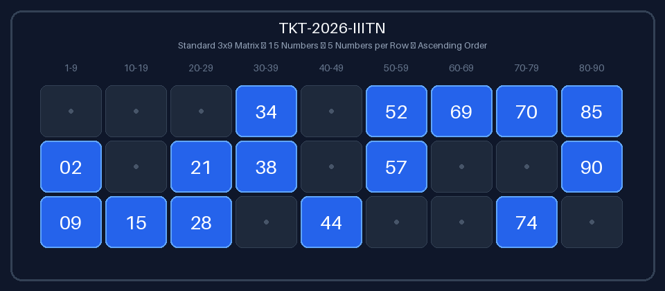

# Task 1: Tambola (Housie) Ticket Generator
**Author**: Anuj Bajpayee ([anujbajpayee14@gmail.com](mailto:anujbajpayee14@gmail.com))

## 📖 Overview
Generates mathematically valid $3 \times 9$ Tambola (Housie) tickets and full 6-ticket strips ($1 \dots 90$) using a deterministic **Constraint-Satisfaction Problem (CSP)** engine.

---

## 🎟️ Visual Sample Output



---

## 🎯 1. Ticket Invariants & Constraints

A valid Tambola ticket $\mathbf{M} \in \mathbb{N}_0^{3 \times 9}$ satisfies seven strict rules:

| # | Invariant | Formulation | Description |
| :-: | :--- | :--- | :--- |
| **1** | **Grid Dimensions** | $\text{dim}(\mathbf{M}) = 3 \times 9$ | Exactly 3 rows and 9 columns (27 cells). |
| **2** | **Row Capacity** | $\forall i: \sum_{j=0}^{8} \mathbb{I}(M_{i, j} > 0) = 5$ | Exactly 5 numbers and 4 blank spaces per row. |
| **3** | **Total Numbers** | $\sum_{i,j} \mathbb{I}(M_{i, j} > 0) = 15$ | Exactly 15 numbers (12 blanks) per ticket. |
| **4** | **Column Capacity** | $\forall j: 1 \le \sum_{i=0}^{2} \mathbb{I}(M_{i, j} > 0) \le 3$ | Every column has between 1 and 3 numbers. |
| **5** | **Decade Ranges** | $\text{Col } j \in \mathcal{D}_j$ | Col 0: $[1, 9]$, Col 1: $[10, 19]$, ..., Col 8: $[80, 90]$. |
| **6** | **Column Sorting** | $i_1 < i_2 \implies M_{i_1, j} < M_{i_2, j}$ | Numbers in each column increase top-to-bottom. |
| **7** | **Uniqueness** | $|\{M_{i, j} : M_{i, j} > 0\}| = 15$ | No duplicate numbers on a ticket. |

---

## ⚡ 2. Why Naive 0/1 Random Masking Fails

A naive approach randomly picks 5 columns per row independently. Because it ignores column capacities:

$$P(\text{column } c \text{ is empty across 3 rows}) = \left(\frac{\binom{8}{5}}{\binom{9}{5}}\right)^3 = \left(\frac{4}{9}\right)^3 \approx 8.78\%$$

Across 9 columns, this causes a **$\approx 28.5\%$ rejection rate** for single tickets and **$>99.9\%$ failure rate** for 6-ticket strips.

---

## 🛠️ 3. Constraint-Satisfaction (CSP) Pipeline

1. **Column Demand Partitioning**: Allocates counts $k_0 \dots k_8$ such that $\sum k_j = 15$ and $1 \le k_j \le 3$.
2. **Bipartite Row-Column Matching**: Assigns binary cell slots satisfying $(5, 5, 5)$ row capacities with zero deadlocks.
3. **Decade Sampling & Sorting**: Samples $k_j$ unique values from decade pool $\mathcal{D}_j$ and sorts them vertically.

For a full **6-ticket strip ($1 \dots 90$)**, pools are partitioned deterministically ($9$ numbers in Col 0, $10$ in Cols 1–7, $11$ in Col 8) ensuring complete, non-overlapping coverage of all 90 numbers.

---

## 💻 4. CLI Execution & Testing

```bash
# Generate a single valid Tambola ticket
python task_1_tambola_ticket_generator/main.py --ticket

# Generate a full 6-ticket strip (numbers 1-90)
python task_1_tambola_ticket_generator/main.py --strip

# Export visual cards
python task_1_tambola_ticket_generator/main.py --ticket --export-svg task_1_tambola_ticket_generator/outputs/sample_ticket_1.svg --export-png task_1_tambola_ticket_generator/outputs/sample_ticket_1.png

# Run unit tests
pytest task_1_tambola_ticket_generator/test_tambola.py -v
```

---

## 📜 License
This task is part of `dip_lab_tasks` licensed under the **MIT License**.
