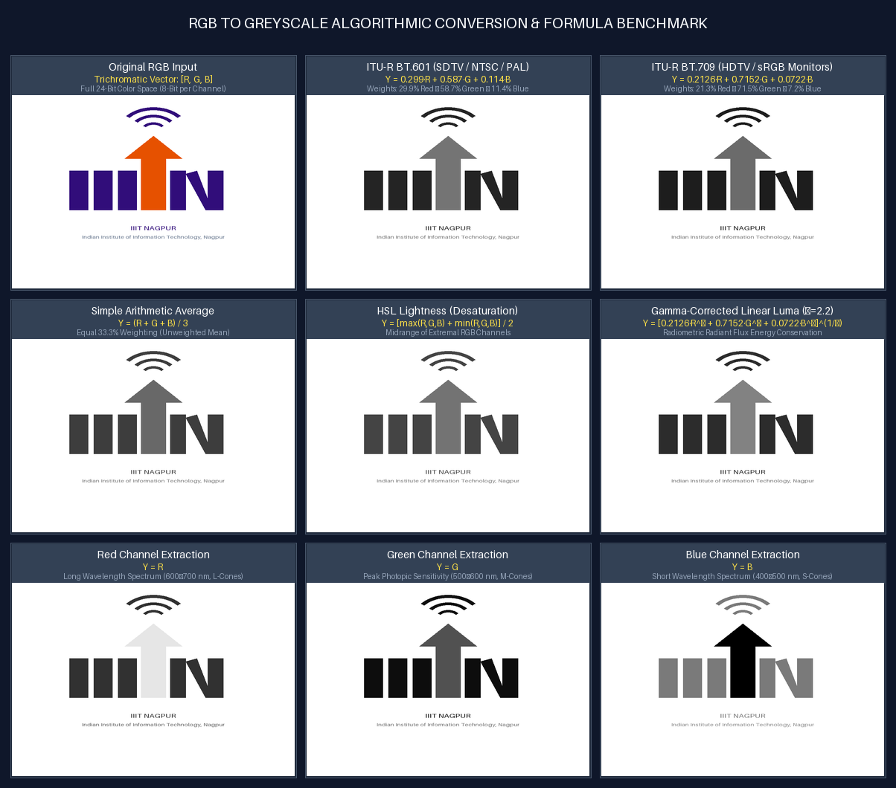

# Task 2: Standard RGB to Greyscale Image Conversion
**Author**: Anuj Bajpayee ([anujbajpayee14@gmail.com](mailto:anujbajpayee14@gmail.com))

## 📖 Overview
Implements standard algorithms for converting trichromatic RGB images into monochromatic greyscale representations based on perceptual luminance weighting and color models.

---

## 🖼️ Visual Benchmark on IIIT Nagpur Logo

Comparison grid displaying original input, single channel extractions (R, G, B), and weighted conversions:



---

## 📐 1. Mathematical Formulations

| Method | Formula | Description / Standard |
| :--- | :--- | :--- |
| **ITU-R BT.601 Luma** | $Y = 0.299 \cdot R + 0.587 \cdot G + 0.114 \cdot B$ | Standard Definition (SDTV / NTSC / PAL) |
| **ITU-R BT.709 Luma** | $Y = 0.2126 \cdot R + 0.7152 \cdot G + 0.0722 \cdot B$ | High Definition (HDTV / sRGB Monitors) |
| **Simple Average** | $Y = \frac{R + G + B}{3}$ | Unweighted Arithmetic Mean |
| **HSL Lightness** | $Y = \frac{\max(R, G, B) + \min(R, G, B)}{2}$ | Desaturation / HSL Model Midpoint |
| **Gamma Corrected** | $Y = 255 \cdot \left(0.2126 R_{\text{lin}} + 0.7152 G_{\text{lin}} + 0.0722 B_{\text{lin}}\right)^{1/\gamma}$ | Radiometric Energy Conservation ($\gamma \approx 2.2$) |

---

## 📊 2. Response Across Pure Primary Colors

| Input Color | $(R, G, B)$ | Rec. 601 | Rec. 709 | Average | Lightness | Gamma Corrected |
| :--- | :---: | :---: | :---: | :---: | :---: | :---: |
| **Pure White** | `(255, 255, 255)` | **255** | **255** | **255** | **255** | **255** |
| **Pure Black** | `(0, 0, 0)` | **0** | **0** | **0** | **0** | **0** |
| **Pure Green** | `(0, 255, 0)` | **150** | **182** | **85** | **128** | **219** |
| **Pure Red** | `(255, 0, 0)` | **76** | **54** | **85** | **128** | **125** |
| **Pure Blue** | `(0, 0, 255)` | **29** | **18** | **85** | **128** | **74** |
| **Pure Yellow** | `(255, 255, 0)` | **226** | **237** | **170** | **128** | **244** |
| **Pure Cyan** | `(0, 255, 255)` | **179** | **201** | **170** | **128** | **227** |
| **Pure Magenta** | `(255, 0, 255)` | **105** | **73** | **170** | **128** | **139** |

---

## 💻 3. CLI Execution & Testing

```bash
# Run greyscale conversions on the IIIT Nagpur logo
python task_2_rgb_to_greyscale_conversion/main.py

# Convert a custom user image
python task_2_rgb_to_greyscale_conversion/main.py --input path/to/image.jpg --output-dir task_2_rgb_to_greyscale_conversion/outputs

# Run unit tests
pytest task_2_rgb_to_greyscale_conversion/test_grayscale.py -v
```

---

## 📜 License
This task is part of `dip_lab_tasks` licensed under the **MIT License**.
