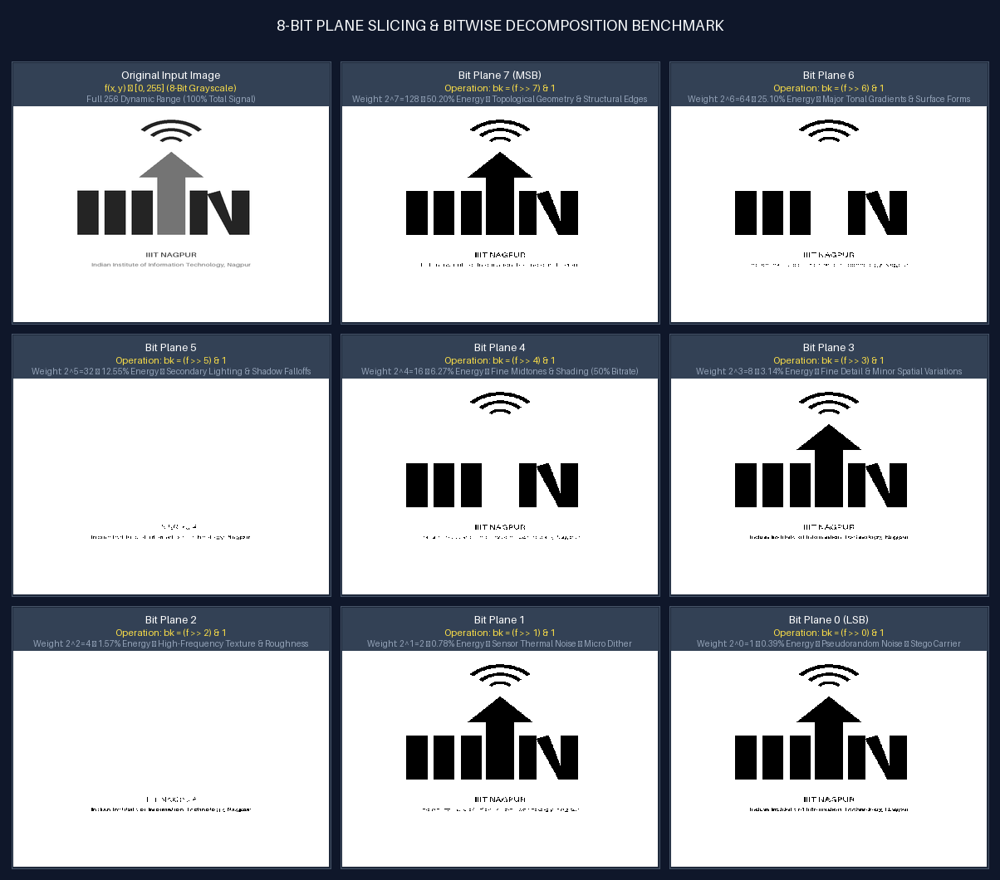
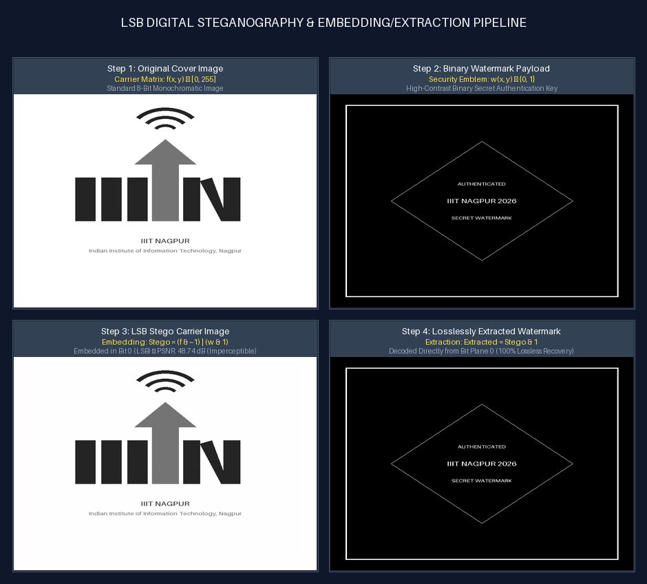

# Task 3: 8-Bit Plane Slicing & Digital Steganography
**Author**: Anuj Bajpayee ([anujbajpayee14@gmail.com](mailto:anujbajpayee14@gmail.com))

## 📖 Overview
Decomposes an 8-bit image into 8 binary matrices (1-bit planes), isolating structural contours in MSB ($b_7$) down to subtle noise in LSB ($b_0$). Applications include multi-plane progressive reconstruction, bit-rate reduction, and Least Significant Bit (LSB) digital steganography.

---

## 🖼️ Visual Benchmarks on IIIT Nagpur Logo

### 1. 8-Bit Plane Decomposition Grid



---

### 2. LSB Digital Steganography & Invisible Watermarking



---

## 📐 1. Mathematical Formulation

An 8-bit pixel value $f(x, y) \in [0, 255]$ is represented in base-2 positional notation:

$$f(x, y) = \sum_{k=0}^{7} b_k(x, y) \cdot 2^k = b_7 \cdot 128 + b_6 \cdot 64 + \dots + b_0 \cdot 1$$

### Bit Plane Extraction
$$b_k(x, y) = (f(x, y) \gg k) \ \& \ 1, \quad I_k(x, y) = 255 \cdot b_k(x, y)$$

---

## 📊 2. Bit Contributions & Positional Weights

| Bit Index ($k$) | Weight ($2^k$) | Energy Contribution | Cumulative Energy ($\sum_{i=k}^7 2^i$) | Role |
| :---: | :---: | :---: | :---: | :--- |
| **Bit 7 (MSB)** | **128** | **50.20%** | **50.20%** | Structural boundaries, global brightness. |
| **Bit 6** | **64** | **25.10%** | **75.29%** | Surface gradients, tonal midtones. |
| **Bit 5** | **32** | **12.55%** | **87.84%** | Lighting transitions, soft shading. |
| **Bit 4** | **16** | **6.27%** | **94.12%** | Fine contours (*>94% total visual fidelity*). |
| **Bit 3** | **8** | **3.14%** | **97.25%** | Minor spatial variations, fine textures. |
| **Bit 2** | **4** | **1.57%** | **98.82%** | Micro-textures, high-frequency details. |
| **Bit 1** | **2** | **0.78%** | **99.61%** | Sensor thermal noise, subtle dither. |
| **Bit 0 (LSB)** | **1** | **0.39%** | **100.00%** | Pseudorandom noise, ideal for LSB steganography. |

---

## ⚙️ 3. Core Applications

### 3.1 Lossy Compression (4 MSB Reconstruction)
$$\hat{f}_{7..4}(x, y) = \sum_{k=4}^{7} 2^k \cdot b_k(x, y) \quad (\text{Saves } 50\% \text{ storage with } >94\% \text{ fidelity})$$

### 3.2 LSB Steganography (Data Hiding)
$$\text{Stego}(x, y) = \left( \text{Cover}(x, y) \ \& \ \sim 1 \right) \mid \left( \text{Watermark}(x, y) \ \& \ 1 \right)$$

$$\text{Extracted}(x, y) = \text{Stego}(x, y) \ \& \ 1$$

---

## 💻 4. CLI Execution & Testing

```bash
# Run bit plane slicing and steganography on IIITN logo
python task_3_bit_plane_slicing/main.py

# Slice a custom user image
python task_3_bit_plane_slicing/main.py --input path/to/image.png --output-dir task_3_bit_plane_slicing/outputs

# Embed watermark into an image
python task_3_bit_plane_slicing/main.py --input path/to/image.png --watermark path/to/logo.png

# Run unit tests
pytest task_3_bit_plane_slicing/test_bit_plane.py -v
```

---

## 📜 License
This task is part of `dip_lab_tasks` licensed under the **MIT License**.
