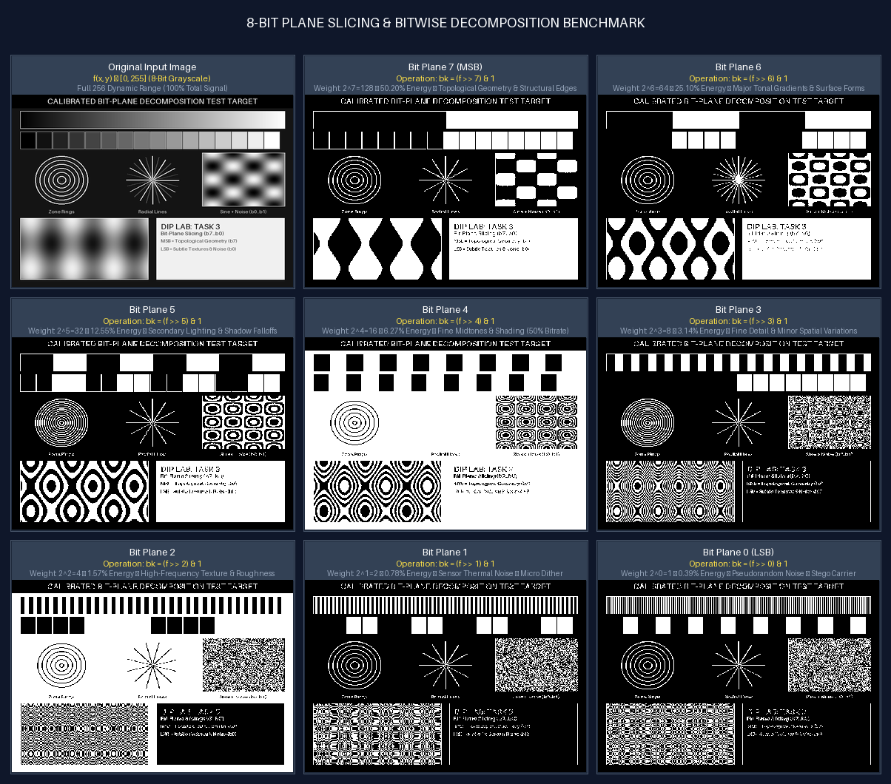
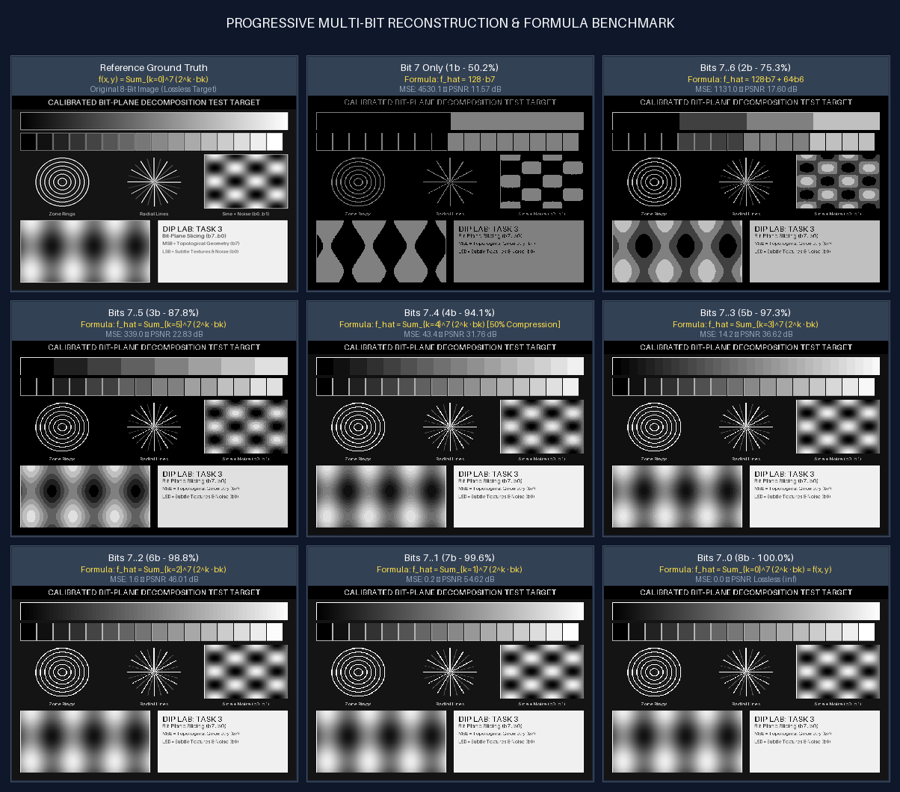
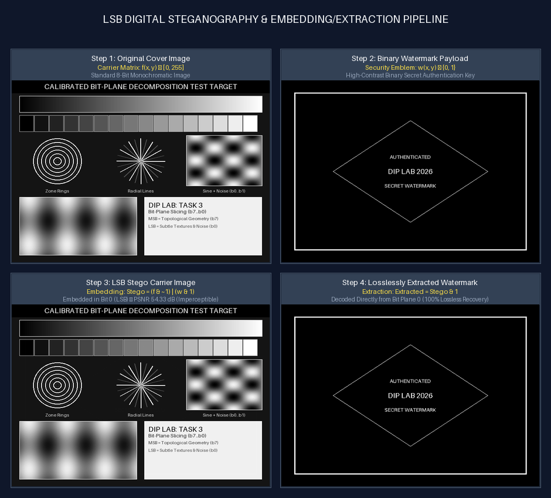
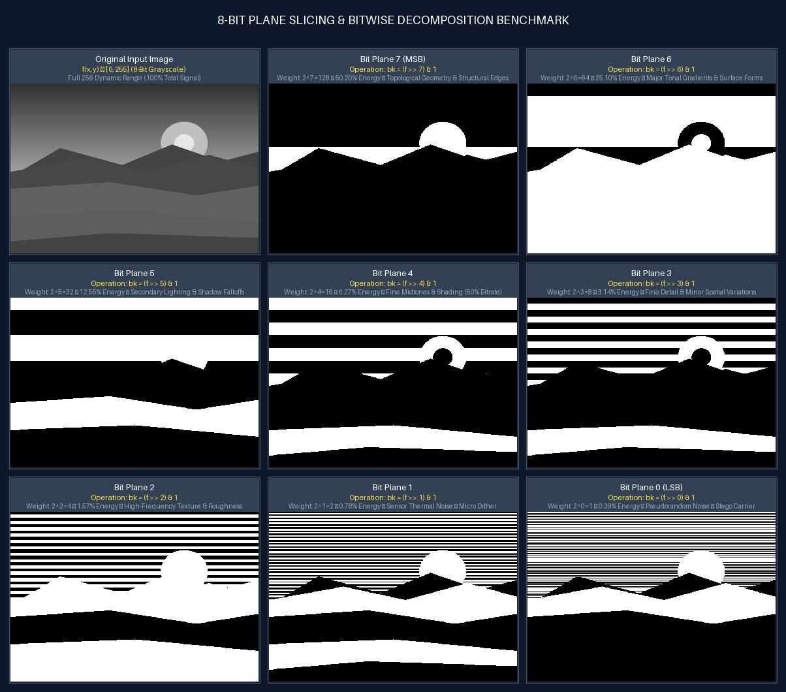
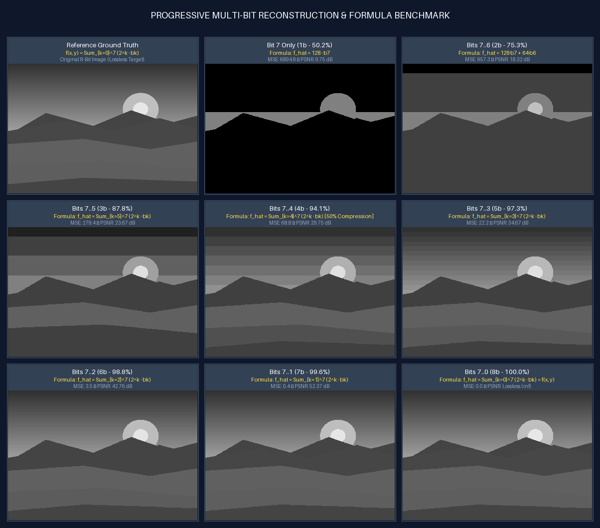

# Task 3: 8-Bit Plane Slicing & Digital Steganography
**Author**: Anuj Bajpayee ([anujbajpayee14@gmail.com](mailto:anujbajpayee14@gmail.com))

## 📖 Overview

In digital image processing, an 8-bit monochromatic image is composed of pixel intensities ranging from $0$ (pure black) to $255$ (pure white). Rather than treating each pixel as an indivisible scalar byte, **Bit-Plane Slicing** decomposes the image into 8 binary matrices (1-bit planes), each corresponding to a specific bit position across all spatial coordinates.

This module provides a scientific and engineering implementation of:
1. **8-Bit Plane Extraction** ($b_7$ down to $b_0$).
2. **Selective Multi-Plane Reconstruction** (Image Compression & Data Reduction).
3. **Progressive Cumulative Decoding** (MSB-first perceptual image transmission).
4. **Information Contribution & Entropy Analysis** (MSE, PSNR, Shannon Entropy).
5. **Least Significant Bit (LSB) Digital Steganography & Watermarking**.

---

## 🖼️ Visual Demonstrations & Comparison Grids

### 1. Input vs 8-Bit Plane Decomposition Grid

Each pixel's 8 bits are isolated into individual binary planes. Notice how **Bit 7 (MSB)** captures global illumination and topological contours, while **Bit 0 (LSB)** captures subtle noise, micro-textures, and high-frequency variations:



---

### 2. Progressive Cumulative Multi-Bit Reconstruction

By summing the highest-order bit planes ($b_7, b_6, b_5, b_4$), we reconstruct over **$94.1\%$ of photometric energy** using only $50\%$ of the data bits (4 bits/pixel), demonstrating the fundamental principle of digital image compression:



---

### 3. LSB Digital Steganography & Invisible Watermarking

A secret binary security watermark is losslessly embedded into the Least Significant Bit plane ($b_0$). The resulting carrier image maintains **$\text{PSNR} > 54\text{ dB}$**, making the modification completely undetectable to the human eye while allowing 100% exact digital extraction:



---

### 4. Photographic Scenery Bit-Plane Analysis

Applied to natural continuous photographic scenes:





---

## 📐 1. Mathematical Foundations & Bit Positional Theory

An 8-bit pixel value $f(x, y) \in [0, 255]$ at spatial coordinate $(x, y)$ is expressed in base-2 positional notation as:

$$f(x, y) = \sum_{k=0}^{7} b_k(x, y) \cdot 2^k = b_7 \cdot 128 + b_6 \cdot 64 + b_5 \cdot 32 + b_4 \cdot 16 + b_3 \cdot 8 + b_2 \cdot 4 + b_1 \cdot 2 + b_0 \cdot 1$$

where $b_k(x, y) \in \{0, 1\}$ represents the binary state of the $k$-th bit.

```text
Byte Layout:
┌───────┬───────┬───────┬───────┬───────┬───────┬───────┬───────┐
│ Bit 7 │ Bit 6 │ Bit 5 │ Bit 4 │ Bit 3 │ Bit 2 │ Bit 1 │ Bit 0 │
│ (MSB) │       │       │       │       │       │       │ (LSB) │
└───────┴───────┴───────┴───────┴───────┴───────┴───────┴───────┘
  2^7     2^6     2^5     2^4     2^3     2^2     2^1     2^0
 (128)   (64)    (32)    (16)     (8)     (4)     (2)     (1)
```

### 1.1 Bit Plane Extraction Formula
The $k$-th bit plane is computed through bitwise right-shift and masking:

$$b_k(x, y) = \left\lfloor \frac{f(x, y)}{2^k} \right\rfloor \bmod 2 = (f(x, y) \gg k) \ \& \ 1$$

For visual display, the binary values $\{0, 1\}$ are scaled to dynamic range $[0, 255]$:

$$I_k(x, y) = 255 \cdot b_k(x, y)$$

---

## 📊 2. Theoretical vs Empirical Bit Contributions

| Bit Plane Index ($k$) | Positional Weight ($2^k$) | Theoretical Energy Contribution | Cumulative Energy ($\sum_{i=k}^7 2^i$) | Perceptual & Structural Role |
| :---: | :---: | :---: | :---: | :--- |
| **Bit 7 (MSB)** | **128** | **50.20%** | **50.20%** | Dominant geometry, structural boundaries, global brightness. |
| **Bit 6** | **64** | **25.10%** | **75.29%** | Primary surface gradients, broad shading, tonal midtones. |
| **Bit 5** | **32** | **12.55%** | **87.84%** | Secondary lighting transitions, soft shadow falloffs. |
| **Bit 4** | **16** | **6.27%** | **94.12%** | Fine shading, smooth contour transitions. (*94% visual fidelity*). |
| **Bit 3** | **8** | **3.14%** | **97.25%** | Minor spatial variations, fine textures. |
| **Bit 2** | **4** | **1.57%** | **98.82%** | Micro-textures, high-frequency surface roughness. |
| **Bit 1** | **2** | **0.78%** | **99.61%** | Sensor thermal noise, subtle sensor dither. |
| **Bit 0 (LSB)** | **1** | **0.39%** | **100.00%** | Pseudorandom noise, ideal for steganographic embedding. |

---

## ⚙️ 3. Core Applications

### 3.1 Lossy Image Compression (Bit Reduction)
By retaining only the 4 most significant bit planes ($b_7, b_6, b_5, b_4$) and setting lower bits to 0:
- Storage footprint drops by **$50\%$** ($4\text{ bits/pixel}$ vs $8\text{ bits/pixel}$).
- Reconstruction retains **$>94\%$ energy** with **$\text{PSNR} > 31.8\text{ dB}$**.

$$\hat{f}_{7..4}(x, y) = \sum_{k=4}^{7} 2^k \cdot b_k(x, y)$$

### 3.2 LSB Digital Steganography (Data Hiding)
Since modifying Bit 0 alters pixel luminance by at most $\pm 1$ level ($\le 0.39\%$), the human visual system cannot perceive the embedded data:

$$\text{Stego}(x, y) = \left( \text{Cover}(x, y) \ \& \ \sim 1 \right) \mid \left( \text{Watermark}(x, y) \ \& \ 1 \right)$$

Extraction is exact and lossless:

$$\text{Extracted}(x, y) = \text{Stego}(x, y) \ \& \ 1$$

---

## 💻 4. Code Structure & Usage

### Files in this Module:
- [`bit_plane.py`](bit_plane.py): Core mathematical extraction, multi-plane reconstruction, and steganography engine.
- [`visualizer.py`](visualizer.py): Calibrated test target synthesizer, watermark generator, and composite grid visualizers with formula annotations.
- [`main.py`](main.py): CLI interface for running bit-plane slicing, metrics logging, and watermark embedding.
- [`test_bit_plane.py`](test_bit_plane.py): Comprehensive Pytest unit test suite.
- [`outputs/`](outputs/): Directory containing all generated outputs and composite visualizers.

### Running via CLI:

```bash
# 1. Synthesize calibration test targets and generate all output grids
python task_3_bit_plane_slicing/main.py --generate-test-patterns

# 2. Slice any custom user image
python task_3_bit_plane_slicing/main.py --input path/to/image.png --output-dir task_3_bit_plane_slicing/outputs

# 3. Embed a custom watermark into an image
python task_3_bit_plane_slicing/main.py --input path/to/image.png --watermark path/to/logo.png
```

### Running Unit Tests:
```bash
pytest task_3_bit_plane_slicing/test_bit_plane.py -v
```

---

## 📜 License
This task is part of `dip_lab_tasks` licensed under the **MIT License**.
