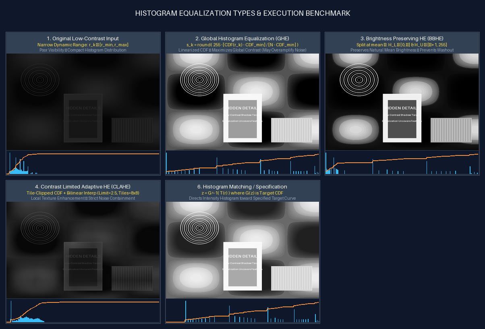
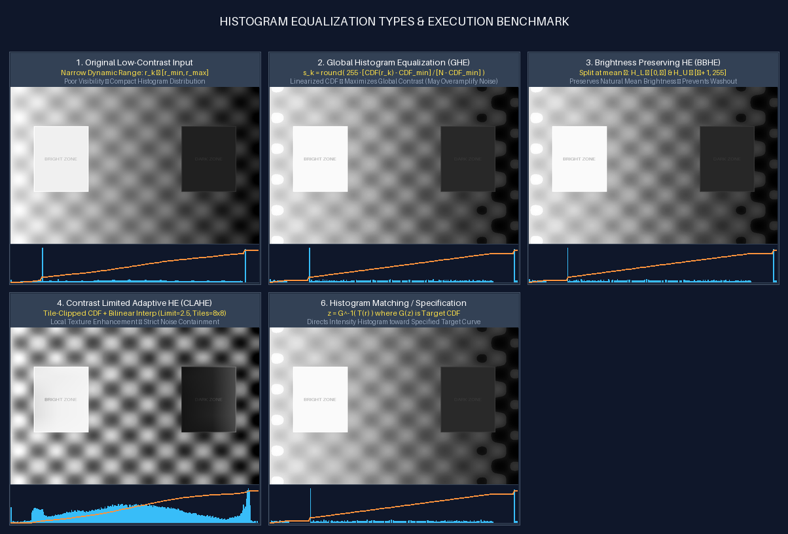
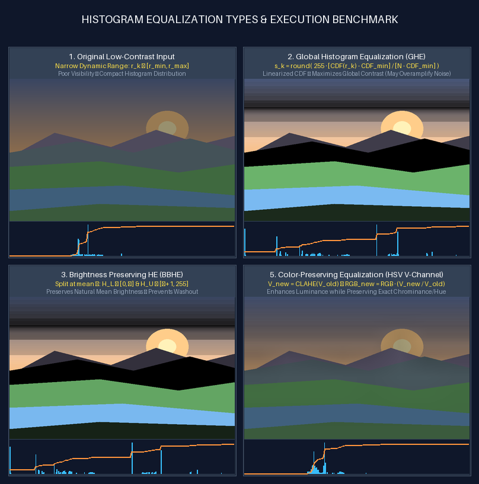

# Task 4: Histogram Equalization Types & Execution
**Author**: Anuj Bajpayee ([anujbajpayee14@gmail.com](mailto:anujbajpayee14@gmail.com))

## 📖 Overview

Histogram Equalization is an essential non-linear spatial contrast enhancement technique that redistributes pixel intensity levels so that the image histogram approaches a more uniform or target distribution.

This module implements and compares the primary industrial and scientific variants of histogram equalization:
1. **Global Histogram Equalization (GHE)**
2. **Brightness Preserving Bi-Histogram Equalization (BBHE)**
3. **Contrast Limited Adaptive Histogram Equalization (CLAHE)**
4. **Histogram Matching / Specification (HM)**
5. **Color-Preserving Equalization (HSV Value Channel)**

---

## 🖼️ Visual Demonstrations & Algorithmic Comparison

### 1. Under-Exposed Low-Contrast Scene Benchmark

Equalizing an under-exposed nighttime scene with hidden architectural contours and shadow text. Notice how GHE and BBHE reveal hidden details across $[0, 255]$, while CLAHE provides controlled local contrast:



---

### 2. Uneven Illumination Benchmark (Bright vs Dark Regions)

Demonstrates how standard GHE can over-expose bright regions, while CLAHE maintains balanced local contrast across both bright and dark zones:



---

### 3. Color Landscape Equalization (HSV Luminance Channel)

Applying histogram equalization directly to the **Value ($V$)** channel in HSV space improves tonal dynamic range without causing color shifts or chromatic distortion:



---

## 📊 1. Types of Histogram Equalization

| # | Method | Mathematical Formulation | Best Use Case | Key Tradeoff |
| :-: | :--- | :--- | :--- | :--- |
| **1** | **Global Histogram Equalization (GHE)** | $s_k = \text{round}\left( \frac{\text{CDF}(r_k) - \text{CDF}_{\min}}{(M \times N) - \text{CDF}_{\min}} \times 255 \right)$ | Uniformly dark or washed-out images with narrow histograms. | Can over-amplify background noise and shift average brightness. |
| **2** | **Bi-Histogram Equalization (BBHE)** | Splits at mean $\mu = \text{round}(\text{mean}(f))$:<br>• Lower $[0, \mu]$ equalized over $[0, \mu]$<br>• Upper $[\mu+1, 255]$ equalized over $[\mu+1, 255]$ | Consumer photos, medical imaging where natural brightness must be preserved. | Moderate contrast gain compared to full GHE. |
| **3** | **Contrast Limited Adaptive HE (CLAHE)** | • Divides image into $8 \times 8$ grid tiles<br>• Clips histogram peak at `clip_limit` (e.g. $2.5$)<br>• Redistributes excess uniformly<br>• Bilinear interpolation across tile centers | Medical radiographs, satellite imagery, underwater/foggy photography. | Higher computational complexity than GHE. |
| **4** | **Histogram Matching (Specification)** | $z = G^{-1}( T(r) )$<br>where $T(r) = \text{CDF}_{\text{src}}(r)$ and $G(z) = \text{CDF}_{\text{ref}}(z)$ | Normalizing image datasets, color grading, matching camera profiles. | Requires a predefined reference target distribution. |
| **5** | **Color HSV Equalization** | $V_{\text{new}} = \text{CLAHE}(V_{\text{old}})$<br>$\text{RGB}_{\text{new}} = \text{RGB}_{\text{old}} \cdot \left(\frac{V_{\text{new}}}{V_{\text{old}}}\right)$ | RGB color photographs, outdoor scenes, video processing. | Requires color-space conversion ($RGB \leftrightarrow HSV$). |

---

## 💻 2. Code Structure & Usage

### Files in this Module:
- [`histogram.py`](histogram.py): Core vectorized NumPy implementations of GHE, BBHE, CLAHE, Histogram Matching, and HSV Color Equalization.
- [`visualizer.py`](visualizer.py): Low-contrast test synthesizers, 256-bin histogram/CDF plot generator, and composite comparison grids.
- [`main.py`](main.py): Standalone CLI runner with automatic statistical profiling.
- [`test_histogram.py`](test_histogram.py): Pytest unit test suite.
- [`outputs/`](outputs/): Generated output images, histograms, and labeled benchmark comparison grids.

### Running via CLI:

```bash
# 1. Synthesize low-contrast test patterns and generate all comparison grids
python task_4_histogram_equalization/main.py --generate-test-patterns

# 2. Equalize any custom user image
python task_4_histogram_equalization/main.py --input path/to/image.jpg --output-dir task_4_histogram_equalization/outputs
```

### Python API Example:

```python
from PIL import Image
import numpy as np
from task_4_histogram_equalization.histogram import (
    global_histogram_equalization,
    bi_histogram_equalization,
    clahe,
    color_histogram_equalization
)

# Load image
img = np.array(Image.open("input.png"))

# 1. Global HE
ghe_img = global_histogram_equalization(img)

# 2. Brightness-Preserving Bi-HE
bbhe_img = bi_histogram_equalization(img)

# 3. CLAHE (Local Adaptive)
clahe_img = clahe(img, clip_limit=2.5, tile_grid_size=(8, 8))

# 4. Color Image (HSV V-Channel)
color_clahe = color_histogram_equalization(img, method="clahe")
```

### Running Unit Tests:
```bash
pytest task_4_histogram_equalization/test_histogram.py -v
```

---

## 📜 License
This task is part of `dip_lab_tasks` licensed under the **MIT License**.
