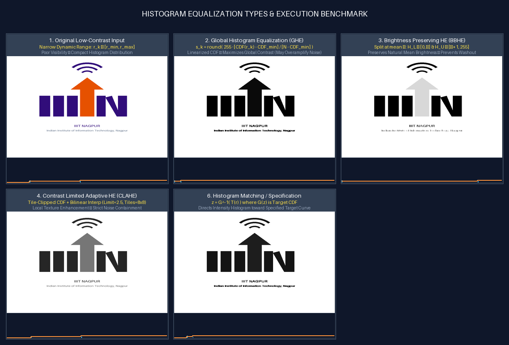

# Task 4: Histogram Equalization Types & Execution
**Author**: Anuj Bajpayee ([anujbajpayee14@gmail.com](mailto:anujbajpayee14@gmail.com))

## 📖 Overview
Implements spatial contrast enhancement algorithms that redistribute pixel intensity levels across the dynamic range $[0, 255]$.

---

## 🖼️ Visual Benchmark on IIIT Nagpur Logo

Comparison grid displaying original input alongside GHE, BBHE, CLAHE, and Color HSV equalizations with corresponding histograms and Cumulative Distribution Functions (CDFs):



---

## 📊 1. Types of Histogram Equalization

| # | Method | Mathematical Formulation | Best Use Case |
| :-: | :--- | :--- | :--- |
| **1** | **Global Histogram Equalization (GHE)** | $s_k = \text{round}\left( \frac{\text{CDF}(r_k) - \text{CDF}_{\min}}{(M \times N) - \text{CDF}_{\min}} \times 255 \right)$ | Uniformly low-contrast images across whole frame. |
| **2** | **Bi-Histogram Equalization (BBHE)** | Splits at mean $\mu = \text{mean}(f)$:<br>• Lower $[0, \mu]$ equalized over $[0, \mu]$<br>• Upper $[\mu+1, 255]$ equalized over $[\mu+1, 255]$ | Preserves natural scene brightness while boosting contrast. |
| **3** | **Contrast Limited Adaptive HE (CLAHE)** | • Divides image into $8 \times 8$ local tiles<br>• Clips histogram peak at `clip_limit` (e.g. $2.5$)<br>• Redistributes excess uniformly<br>• Bilinear interpolation across tile centers | Non-uniform lighting, medical radiographs, underwater/hazy scenes. |
| **4** | **Histogram Matching (Specification)** | $z = G^{-1}( T(r) )$ where $T(r) = \text{CDF}_{\text{src}}(r)$, $G(z) = \text{CDF}_{\text{ref}}(z)$ | Matching camera profiles, dataset normalization. |
| **5** | **Color HSV Equalization** | Equalizes only Value ($V$) channel in HSV color space:<br>$V_{\text{new}} = \text{CLAHE}(V_{\text{old}}), \quad \text{RGB}_{\text{new}} = \text{RGB}_{\text{old}} \cdot \left(\frac{V_{\text{new}}}{V_{\text{old}}}\right)$ | RGB color photographs without hue/saturation distortion. |

---

## 💻 2. CLI Execution & Testing

```bash
# Run histogram equalization on IIIT Nagpur logo
python task_4_histogram_equalization/main.py

# Equalize custom user image
python task_4_histogram_equalization/main.py --input path/to/image.jpg --output-dir task_4_histogram_equalization/outputs

# Run unit tests
pytest task_4_histogram_equalization/test_histogram.py -v
```

---

## 📜 License
This task is part of `dip_lab_tasks` licensed under the **MIT License**.
