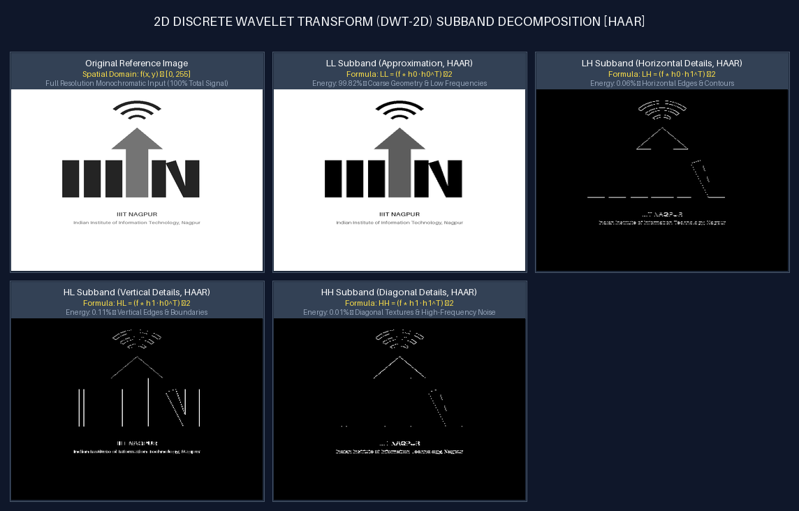
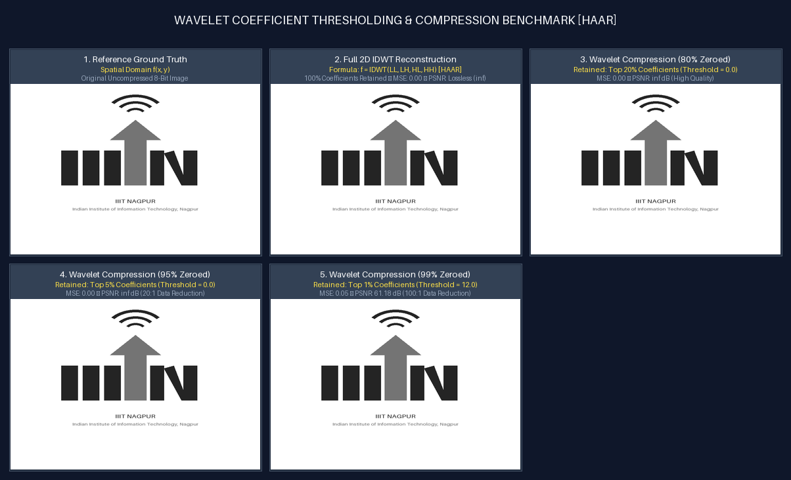
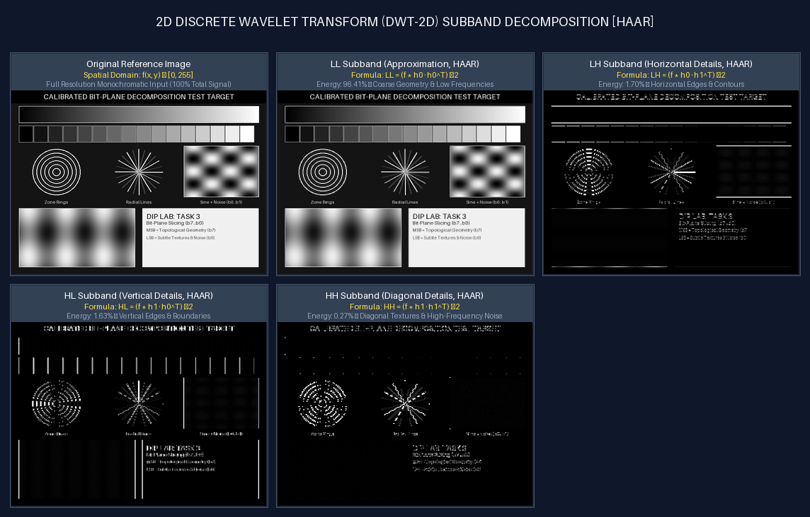

# Task 5: 2D Discrete Wavelet Transform (DWT & IDWT)
**Author**: Anuj Bajpayee ([anujbajpayee14@gmail.com](mailto:anujbajpayee14@gmail.com))

## 📖 Overview

The **2D Discrete Wavelet Transform (2D DWT)** provides multi-resolution, space-frequency localization by decomposing digital images into an approximation subband ($LL$) capturing low-frequency global structures, and three directional detail subbands ($LH, HL, HH$) capturing horizontal, vertical, and diagonal high-frequency transitions.

This module provides a self-contained, vectorized mathematical implementation of:
1. **Single-Level 2D DWT** ($LL_1, LH_1, HL_1, HH_1$).
2. **2D Inverse DWT (IDWT)** with exact mathematical lossless reconstruction ($f = \text{IDWT}(\text{DWT}(f))$).
3. **Multi-Level Hierarchical Decomposition** (Level 1, Level 2, Level 3 Quad-Trees).
4. **Subband Energy Distribution Analysis** (Parseval's energy theorem).
5. **Wavelet Thresholding & Lossy Compression** (Reconstruction from sparse coefficients).

---

## 🖼️ Visual Demonstrations & Subband Grids

### 1. IIIT Nagpur Logo Subband Decomposition Grid

Decomposition of the official **IIIT Nagpur Logo** into approximation and directional edge subbands:



---

### 2. Wavelet Compression & Sparsity Benchmark

By retaining only the top **5% to 20% largest wavelet detail coefficients** and zeroing out the rest, we achieve significant data reduction while preserving sharp edge boundaries and visual fidelity:



---

### 3. Calibrated Test Target Subband Decomposition

Applied to the complex calibrated test target isolating geometric circles, radial starburst lines, and fine typography:



---

## 📐 1. Mathematical Foundations & Mallat 2D Algorithm

For an image $f(x, y)$, the 2D DWT applies 1D low-pass scaling filter $h_0$ and high-pass wavelet filter $h_1$ separable along rows and columns, followed by dyadic downsampling ($\downarrow 2$):

$$LL(x, y) = \sum_{m} \sum_{n} h_0[m] h_0[n] f(2x + m, 2y + n)$$

$$LH(x, y) = \sum_{m} \sum_{n} h_0[m] h_1[n] f(2x + m, 2y + n) \quad \text{(Horizontal Edges)}$$

$$HL(x, y) = \sum_{m} \sum_{n} h_1[m] h_0[n] f(2x + m, 2y + n) \quad \text{(Vertical Edges)}$$

$$HH(x, y) = \sum_{m} \sum_{n} h_1[m] h_1[n] f(2x + m, 2y + n) \quad \text{(Diagonal Textures)}$$

```text
2D DWT Subband Layout:
┌───────────────────────┬───────────────────────┐
│                       │                       │
│        LL             │        LH             │
│   (Approximation)     │   (Horizontal Edges)  │
│                       │                       │
├───────────────────────┼───────────────────────┤
│                       │                       │
│        HL             │        HH             │
│   (Vertical Edges)    │   (Diagonal Details)  │
│                       │                       │
└───────────────────────┴───────────────────────┘
```

---

## 📊 2. Subband Energy Distribution

By Parseval's relation, the total spatial photometric energy equals the sum of subband energies:

$$E_{\text{total}} = \sum_{x, y} |f(x, y)|^2 = E(LL) + E(LH) + E(HL) + E(HH)$$

| Subband | Transformation Operator | Typical Energy % | Perceptual & Structural Role |
| :---: | :--- | :---: | :--- |
| **$LL$** | Low-pass row $\ast$ Low-pass col ($\downarrow 2$) | **$> 96.0\%$** | Coarse image approximation, global illumination, and morphology. |
| **$LH$** | Low-pass row $\ast$ High-pass col ($\downarrow 2$) | **$1.0\% - 2.5\%$** | Horizontal high-frequency edges and row transitions. |
| **$HL$** | High-pass row $\ast$ Low-pass col ($\downarrow 2$) | **$1.0\% - 2.5\%$** | Vertical high-frequency edges and column transitions. |
| **$HH$** | High-pass row $\ast$ High-pass col ($\downarrow 2$) | **$< 0.5\%$** | Diagonal textures, sharp corners, and high-frequency noise. |

---

## 💻 3. Code Structure & Usage

### Files in this Module:
- [`wavelet.py`](wavelet.py): 2D DWT, 2D IDWT, multi-level quad-tree decomposition, subband energy profiler, and coefficient thresholding.
- [`visualizer.py`](visualizer.py): Labeled 4-subband composite grids, multi-level quad-tree mosaic generator, and compression benchmark visualizers.
- [`main.py`](main.py): CLI interface for running wavelet transformations and statistical logging.
- [`test_wavelet.py`](test_wavelet.py): Comprehensive Pytest unit test suite.
- [`outputs/`](outputs/): Generated output images, subband mosaics, and compression comparison grids.

### Running via CLI:

```bash
# 1. Synthesize wavelet benchmarks for IIITN Logo, test targets, and scenery
python task_5_wavelet_transform/main.py --generate-test-patterns

# 2. Transform any custom user image
python task_5_wavelet_transform/main.py --input path/to/image.png --wavelet haar --level 2
```

### Python API Example:

```python
from PIL import Image
import numpy as np
from task_5_wavelet_transform.wavelet import dwt2, idwt2, compute_wavelet_energy

# Load image
img = np.array(Image.open("assets/iiitn_logo.png").convert("L"))

# 1. Forward 2D DWT
ll, (lh, hl, hh) = dwt2(img, wavelet="haar")

# 2. Inverse Lossless 2D IDWT
recon = idwt2((ll, (lh, hl, hh)), wavelet="haar")

# 3. Subband Energy Analysis
energy_stats = compute_wavelet_energy((ll, (lh, hl, hh)))
print(f"LL Subband holds {energy_stats['LL']['energy_pct']}% of total image energy.")
```

### Running Unit Tests:
```bash
pytest task_5_wavelet_transform/test_wavelet.py -v
```

---

## 📜 License
This task is part of `dip_lab_tasks` licensed under the **MIT License**.
