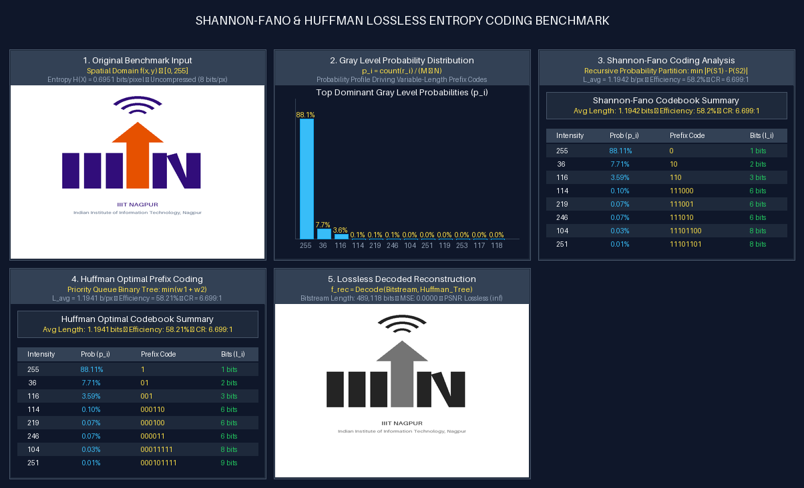

# Task 6: Shannon-Fano & Huffman Image Entropy Coding
**Author**: Anuj Bajpayee ([anujbajpayee14@gmail.com](mailto:anujbajpayee14@gmail.com))

## 📖 Overview
Implements lossless entropy compression using variable-length prefix-free coding (Shannon-Fano & Huffman) based on pixel occurrence probabilities.

---

## 🖼️ Visual Benchmark on IIIT Nagpur Logo

Comparison grid displaying gray-level distribution, Shannon-Fano & Huffman codebooks, and lossless decoded reconstruction:



---

## 📐 1. Mathematical Formulation

### Shannon Entropy (Theoretical Lower Bound)
$$H(X) = -\sum_{i=1}^{K} p_i \log_2(p_i) \quad [\text{bits/pixel}]$$

### Average Codeword Length
$$L_{\text{avg}} = \sum_{i=1}^{K} p_i \cdot l_i \quad [\text{bits/pixel}]$$

### Efficiency & Compression Ratio
$$\eta = \left( \frac{H(X)}{L_{\text{avg}}} \right) \times 100\%, \quad \text{CR} = \frac{8.0}{L_{\text{avg}}} : 1$$

---

## 📊 2. Shannon-Fano vs Huffman Comparison

| Feature | Shannon-Fano Coding | Huffman Optimal Coding |
| :--- | :--- | :--- |
| **Tree Construction** | Top-Down recursive partitioning $\min \|\sum_{S_1} p_i - \sum_{S_2} p_j\|$ | Bottom-Up binary min-heap merging lowest probability pairs |
| **Optimality** | Sub-optimal | **Mathematically Optimal** minimum-redundancy prefix code |
| **Bound** | $H(X) \le L_{\text{avg}} \le H(X) + 2$ | $H(X) \le L_{\text{avg}} < H(X) + 1$ |
| **Reconstruction** | Exact Lossless ($\text{MSE} = 0.0$, $\text{PSNR} = \infty$) | Exact Lossless ($\text{MSE} = 0.0$, $\text{PSNR} = \infty$) |

---

## 💻 3. CLI Execution & Testing

```bash
# Run Shannon-Fano and Huffman coding on the IIIT Nagpur logo
python task_6_shannon_huffman_coding/main.py

# Run on custom user image
python task_6_shannon_huffman_coding/main.py --input path/to/image.png

# Run unit tests
pytest task_6_shannon_huffman_coding/test_coding.py -v
```

---

## 📜 License
This task is part of `dip_lab_tasks` licensed under the **MIT License**.
