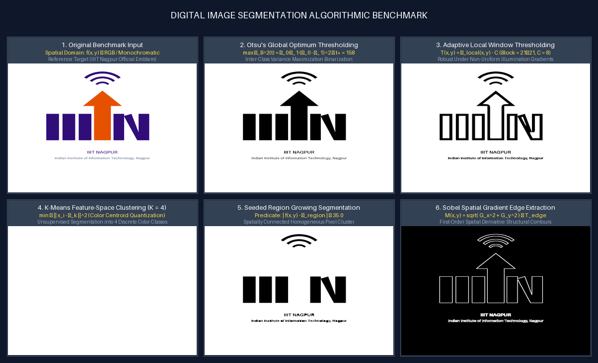

# Task 7: Digital Image Segmentation
**Author**: Anuj Bajpayee ([anujbajpayee14@gmail.com](mailto:anujbajpayee14@gmail.com))

## 📖 Overview
Partitions an image into visually meaningful and homogeneous regions using 5 fundamental segmentation paradigms.

---

## 🖼️ Visual Benchmark on IIIT Nagpur Logo

Comparison grid displaying original input, Otsu global thresholding, adaptive local thresholding, $K=4$ color clustering, seeded region growing, and Sobel edge boundaries:



---

## 📐 1. Mathematical Formulations

### 1. Otsu's Inter-Class Variance Maximization
$$\sigma_B^2(t) = \omega_0(t) \cdot \omega_1(t) \cdot \left( \mu_0(t) - \mu_1(t) \right)^2, \quad t^* = \arg\max_{0 \le t < 256} \sigma_B^2(t)$$

### 2. Adaptive Local Window Thresholding
$$T(x, y) = \mu_{\text{local}}(x, y) - C = \left( \frac{1}{W^2} \sum_{i, j \in W} f(x+i, y+j) \right) - C$$

### 3. K-Means Feature-Space Clustering
$$J = \sum_{k=1}^{K} \sum_{x_i \in C_k} \| x_i - \mu_k \|^2$$

### 4. Seeded Region Growing
$$\text{Homogeneity: } | f(x, y) - \mu_{\text{region}} | \le T_{\text{tolerance}}$$

### 5. Sobel Gradient Edge Extraction
$$G_x = \begin{bmatrix} -1 & 0 & +1 \\ -2 & 0 & +2 \\ -1 & 0 & +1 \end{bmatrix} * f, \quad G_y = \begin{bmatrix} -1 & -2 & -1 \\ 0 & 0 & 0 \\ +1 & +2 & +1 \end{bmatrix} * f$$

$$M(x, y) = \sqrt{G_x^2 + G_y^2} \ge T_{\text{edge}}$$

---

## 📊 2. Method Comparison

| Method | Domain | Key Advantage | Best Use Case |
| :--- | :--- | :--- | :--- |
| **Otsu Global** | 1D Intensity Histogram | Non-parametric, optimal for bimodal distributions | Document scanning, background isolation |
| **Adaptive Local** | 2D Spatial Neighborhood | Handles severe lighting gradients and shadows | Uneven illumination, microscopy |
| **K-Means Clustering** | 3D Color Vector Space | Natural grouping into $K$ color segments | Land cover, multi-color segmentation |
| **Region Growing** | Spatial + Intensity | Guaranteed connected, contiguous object segments | Medical lesion/organ isolation |
| **Sobel Edge** | 2D Spatial Derivatives | Preserves fine structural contours and corners | Shape boundary extraction |

---

## 💻 3. CLI Execution & Testing

```bash
# Run all segmentation methods on the IIIT Nagpur logo
python task_7_image_segmentation/main.py

# Run on custom user image
python task_7_image_segmentation/main.py --input path/to/image.png

# Run unit tests
pytest task_7_image_segmentation/test_segmentation.py -v
```

---

## 📜 License
This task is part of `dip_lab_tasks` licensed under the **MIT License**.
